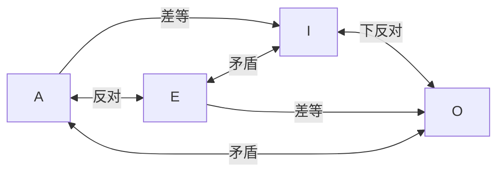

# 逻辑
思维规律、客观规律、看问题的特殊方法或视角

逻辑学：研究推理有效性的学问（推理的形式有效性）

推理是思维的基本形式、一个完整的推理是由若干了判断组成、判断由若干概念组成（论证>推理>判断>概念）

传统逻辑：前 4 世纪->1890 年 自然语言

现代逻辑：形式语言

如果 p，那么 q，所以，如果非 q，那么并非 p

## 逻辑学简史
逻辑学的萌芽：早期

+ 中国：
    - 邓析（名家）开拓者
    - 孔子（儒家）正名学说 萌芽
    - 墨子（墨家）《墨经》创立
+ 印度
    - 美达悌西 乔达摩
    - 弥勒 《瑜伽师地论》
    - 陈那
+ 希腊
    - 亚里士多德：《工具论》创立了逻辑学

逻辑学的发展：中期

+ 中世纪
    - 逻辑被列为学校教育必修课
    - 经院哲学家进一步发展了逻辑学
+ 文艺复兴
    - 弗兰西斯·培根《新区具》提出“三表法”和“排除法”的归纳方法
    - 穆勒进一步发展了归纳思想。提出了“穆勒五法”，即求同法、求异法、求同求异并用法、共变法和差异法。

现代逻辑学

+ 1879年，德国逻辑学家弗雷格发表了《概念文字——一种按算术公式构成的纯思维的符号语言》，建立了第一个现代逻辑演算系统，这标志着现代逻辑的诞生

# 概念
## 概念概述
### 什么是概念
概念：是反映思维对象及其特有属性或者本质属性的思维形式

思维对象的属性：指思维对象的性质以及思维对象之间的关系

特有属性或者本质属性：使某一对象称为单独一类并使其与其他对象相区别的属性

概念是思维的起点，是组成判断和推理的基本要素

### 语词与概念
+ 不是所有的语词都表达概念
+ 理论上说，所有概念都能用语词表达，而实际上有些概念并没有恰当的语词来表达
+ 同一个概念可以用不同的语词表达
+ 同一个语词可以表达不同的概念
+ 语词是概念的语言形式，而概念是语词的思想内容

### 概念的内涵和外延
+ 任何概念都有两个基本的逻辑特征，即内涵和外延
+ 概念的内涵：反映在概念中的对象的特有属性或者本质属性
+ 概念的外延：具有概念所反映的特有属性或者本质属性的对象所组成的集合（或者类）又称为概念的适用对象
+ 空概念：概念的外延为空集，即具有概念所反映的属性或者关系的对象并不存在

## 概念种类
|  依据  |  分类  |
| --- | --- |
| 概念外延的大小 | 空概念、单独概念、普遍概念 |
| 所反映的对象是否集合体 | 集合概念、非集合概念 |
| 所反映的是个体、性质还是关系 | 个体概念、性质概念、关系概念 |
| 所反映的对象是否具有某种属性 | 正概念、负概念 |

| | 空概念 | 单独概念 | 普遍概念 |
| --- | --- | --- | --- |
| 定义 | 外延为空集 | 外延只有一个对象 | 外延包括一个以上对象 |
| 举例 | 永动机、方形的圆 | 专有名词+摹状词：拿破仑、埃菲尔铁塔、世界上最高的山 | 海拔超过 1km 的山、大学 |

| | 集合概念 | 非集合概念 |
| --- | --- | --- |
| 定义 | 所反映的对象是一个集合 | 取反 |
| 说明 | 所反映的集合体是多个同类个体组成的统一整体（集合体和个体的关系【整体与部分】） |  |
| 举例 | 西沙群岛、山脉、森林 | 桃花岛、台湾岛 |

## 概念间的关系
外延之间存在以下五种关系

+ 同一关系：当且仅当 AB 的外延完全相同
+ 真包含关系：当且仅当存在对象 x，x 属于 B 也属于 A，但对象 y 属于 A 不属于 B【属概念包含种概念】
+ 真包含于关系：真包含关系反过来
+ 交叉关系：当且仅当，存在 x 属于 AB，存在 y 属于 A 不属于 B，存在 z 不属于 A 属于 B
+ 全异关系：AB 外延完全不同
    - 矛盾关系：机动车和非机动车（相对于车辆）
    - 反对关系：唐诗和宋词（相对于中国文学）

相容关系：AB 的外延存在相同的部分

不相容关系：不存在

## 概念的概括和限制
概念的内涵和外延是相互依存的，存在反变关系

反变关系：

+ 一个概念的内涵越多，则外延越小
+ 一个概念的内涵越少，则外延越大
+ 一个概念的外延越大，则内涵越少
+ 一个概念的外延越小，则内涵越多

概念的限制：通过增加概念的内涵、缩小概念的外延来明确概念逻辑的一种方法【案例：人->纯粹的人->有道德的人->有益于人民的人】

概念限制：由属概念增加内涵过渡到相应的种概念

+ 给属概念增加限定词【小伙->帅气的小伙】
+ 由外延较大的属概念直接过渡到外延较小的种概念的方法【水果->苹果】

概念概括：减少内涵、扩大外延【过失犯罪->犯罪】

+ 减少限定词【东方古代哲学->哲学】
+ 由外延较小的种概念直接过渡到外延较大的属概念的方法【心理学->社会科学】

## 概念的定义
以确切、简明的语句揭示概念的内涵或者外延的逻辑方法

定义的组成：定义一般由被定义项（Ds）、定义项（Dp）和定义联项三部分组成

定义的方法：属加种差、同义定义、示例定义、枚举定义、递归定义

## 概念的划分
划分：通过把一个概念所反映的对象分为若干个小类来揭示这个概念的外延的逻辑方法。通常是把一个属概念分为若干个种概念

+ 现代逻辑可以分为纯逻辑和应用逻辑两种类型
+ 中国民族乐器可分为吹奏乐器、弹拨乐器、拉奏乐器和打击乐器四大类

划分的三要素：划分的母项、划分的子项和划分的标准

分解：是把一个表示对象整体的概念，分成表示该对象部分的概念

划分的种类

+ 按划分次数：一次划分、连续划分

划分的作用

+ 可以扩展、加深对事物的认识
+ 以明确概念的外延，便于对不同种类的事物进行不同的处理

# 简单判断
## 判断概述
判断：对思维对象有所断定的思维形式

判断的两个基本特征：都有所断定、都有真假

语句是判断的语言表达形式，判断是语句表达的思想内容

语句与判断的关系：

+ 不是所有的语句都表达判断句，一般，陈述句、反问句表达判断，疑问句、祈使句、感叹句不表达判断
+ 同一个判断可以使用不同的语句来表达
+ 同一个语句可以表达不同的判断

命题：表达判断的语句

命题形式：命题的逻辑形式

命题的逻辑形式：与命题具体内容相对的形式结构

判断的种类:

+ 简单判断和复合判断（自身中【不】含有其他判断的判断）
+ 性质判断和关系判断（是否具有某种性质【关系】的判断;）
+ 模态判断和非模态判断（【是否】包含模态词）【可能、必然、曾经、永远】

## 性质判断
性质判断由主项、谓项、联项和量项四部分构成

+ 主项：表示性质判断所断定的对象（S）
+ 谓项：表示性质判断所断定的性质（P）
+ 联项：表表示主谓项的联系（肯定联项和否定联项）
+ 量项：表示主项被断定的数量或范围

按质分：肯定判断、否定判断

按量分：单称判断、全称判断、特称判断

性质判断与概念间的真假判断

+ SAP：所有 S 都是 P
+ SEP：所有 S 都不是 P
+ SIP：有的 S 是 P
+ SOP：有的 S 不是 P

矛盾关系：A 和 O、I 和 E

反对关系：A 和 E，不能同真可以同假

下反对关系：I 和 O，不能同假可以同真

差等关系：A 和 I，E 和 O

| |  同一  |  真包含  |  真包含于  |  交叉  |  全异  |
| --- | --- | --- | --- | --- | --- |
| SAP | 1 | 1 | 0 | 0 | 0 |
| SEP | 0 | 0 | 0 | 0 | 1 |
| SIP | 1 | 1 | 0 | 1 | 0 |
| SOP | 0 | 0 | 1 | 1 | 1 |

在一个性质判断中，如果其主项（或谓项）的全部外延都得到了断定，就称该主项（或谓项）是周延的

口诀：【周周不不、不周不周】

|  判断形式  |  主项  |  谓项  |
| --- | --- | --- |
| A | 周延 | 不周延 |
| E | 周延 | 周延 |
| I | 不周延 | 不周延 |
| O | 不周延 | 周延 |

## 关系判断
关系判断由关系者项、关系项和量项三部分构成

+ 自返、非自返、禁自返
+ 对称、非对称、禁对称
+ 传递、非传递、禁传递

# 复合判断
就是自身中包含有其他判断的判断

## 联言判断
是断定几种事物情况同时存在的判断——全真为真，有假为假

## 选言判断
是断定几种事物情况至少有一种存在的判断

+ 相容选言  全假为假，有真为真
+ 不相容选言  相同为假，不同为真

## 假言判断
断定某一事物情况的存在（或不存在）是另一事物情况存在（或不存在）的条件的判断

假言判断由两个支判断构成

+ 假言判断的前件：前一个支判断
+ 假言判断的后件：后一个支判断

充分条件：如果有p，就必定有q。  p->q 由真指假则为假，反之均为真

必要条件：如果没有p，就必定没有q。非 p->非 q 等价于 q->p，由真指假则为假，反之均为真

充分必要条件：如果有p，就必定有q，如果没有p，就必定没有q。  p<->q，相同为真，不同为假

## 负判断
否定某个判断的判断。又叫判断的否定判断，简称判断的否定

+ 负判断：不是所有的胆怯都是勇敢
+ 否定判断：所有的胆怯都不是勇敢

简单判断的负判断（用 AEIO 当中的矛盾关系指向对向）

复杂判断的负判断：七种（且、或、联言、选言、充分、必要、充分必要）

+ 利用真值表进行推导

## 模态判断
必然 □

或然 ◇

# 逻辑基本规律
## 同一律
在同一思维过程中，每一思想要保持其自身的同一性

+ 概念要明确
+ 判断要同一

违反同一律所犯的逻辑错误

+ 混淆概念
+ 偷换概念
+ 转移论题
+ 偷换论题

## 矛盾律
在同一思维过程中，两个互相否定的思想不能同真，必有一假。矛盾律的主旨是保持思想的一致性

+ 概念相同
+ 判断一致：以子之矛攻子之盾

违反矛盾律所犯的逻辑错误

+ 自相矛盾

## 排中律
在同一思维过程中，两个互相否定的思想不能都假，必有一真

违反排中律所犯的逻辑错误

+ 模棱两可

# 演绎推理
## 推理概论
推理：是由若干判断得出一个判断的思维形式

推理的种类

+ 异类推理：类比推理
+ 同类推理
    - 归纳推理：由特殊到一般
    - 演绎推理：特殊到特殊，一般到一般，一般到特殊

根据推理中前提所含判断数目的不同

+ 直接推理：指的是前提只有一个判断的推理
+ 间接推理：指的是前提含有两个或两个以上判断的推理

根据推理中是否包含模态判断：前提和结论当中是否有模态词

推理形式：指的是推理的前提和结论在形式上的联系方式

## 直接推理
换质法：SAP|-SE!P、SEP|-SA!P、SIP|-SO!P、SOP|-SI!P

换位法：通过交换前提中主、谓项的位置从而得出结论的直接推理

根据换位法，得到的三个有效的推理形式（换了 S 和 P 的位置）不能得到 O

+ SAP |- PAS
+ SEP |- PES
+ SIP |- PIS

先换质后换位：换质（AEIO 更换、P 取反）换位（AEI 当中的 SP 换位）

## 三段论
是由两个包含着一个共同项的性质判断推出出一个新的性质判断的推理

三段论的一般规则

+ 有且只有三个不同的项
+ 中项至少需要周延一次
+ 在前提中不周延的项，到结论中也不周延
+ 两个否定前提推不出结论
+ 如果前提有一个否定，则结论否定，如果结论否定，则前提有一否定
+ 两个特称前提推不出结论
+ 如果两个前提有一个特称，那么结论也是特称

三段论的格：由于中项在前提中的不同位置而构成的三段论的不同形式

+ 中项为大前提的主项、小前提的谓项（小前提必肯定、大前提必全称）反证
+ 中项均为大、小前提的谓项
+ 中项均为大、小前提的主项
+ 中项为大前提的谓项、小前提的主项

三段论的式：指的是AEIO四种判断在两个前提和结论中的各种不同组合所构成的三段论形式 （AAA）

格有 4 种，其中大前提、小前提、结论都可能是 AEIO，故式有 4*4*4=64，格式一共有 4*64 = 256 种，但是其中只有 24 个有效式

| 第一格 | 第二格 | 第三格 | 第四格 |
| --- | --- | --- | --- |
| AAA | AEE | AAI | AAO |
| EAE | EAE | EAO | EAO |
| AII | AOO | AII | AEE |
| EIO | EIO | EIO | EIO |
| ~~AAI~~ | ~~AEO~~ | IAI | IAI |
| ~~EAO~~ | ~~EAO~~ | OAO | ~~AEO~~ |

三段论的省略形式：三段论有省略大前提、省略小前提和省略结论三种形式

## 关系推理
关系推理是前提中至少有一个是关系判断的推理

纯关系推理：指的是前提和结论都是关系判断的推理

+ 对称关系推理：aRb=bRa
+ 禁对称关系推理：aRb = ba!R
+ 传递关系推理：aRb，bRc，则 aRc
+ 禁传递关系推理：aRb，bRc，则 ac!R

混合关系推理：指的是两个前提分别是关系判断和性质判断，结论是关系判断的推理

+ 所有的 a 和 b 有关系 R，c 是 a，所以 c 和 b 有关系 R

# 演绎推理（二）
## 联言推理
是前提或者结论是联言判断的推理

+ 分解式  p 且 q |- p（p 且 q |- q）
+ 合成式：p,q |- p 且 q

## 选言推理
是前提或者结论包含有选言判断的推理

+ 相容选言
    - 否定肯定式 p 或 q ==> !p|-q
    - 析取引入式 p |- p 或 q
+ 不相容选言

## 假言推理
前提中有一个是假言判断并且根据假言判断前后件之间的关系而推出结论的推理【由真指假则为假】

+ 充分条件假言推理：肯定前件式、否定后件式【肯定前必肯定后、否定后必否定前】
+ 必要条件假言推理：否定前件式、肯定后件式【否定前必否定后、肯定后必肯定前】
+ 充分必要条件假言推理：肯前、肯后、否前、否后

## 二难推理
以两个充分条件假言判断和一个选言判断为前提，根据充分条件假言判断和选言判断的逻辑性质得出结论的推理

+ 简单构成式：p->q，r->q，则 p v r |- q
+ 简单破坏式：p->q，p->r，则 !q v !r |- !p
+ 复杂构成式：p->q，r->s，则 p v r |- q v s
+ 复杂破坏式：p->q，r->s，则 !q v !s |- !p v !r

## 其他常用的有效推理形式
+ 假言易位 p->q => !q -> !p
+ 蕴析律 p v q => !p -> q
+ 假言连锁 p->q 且 q->r => p->r
+ 反三段论 (p 且 q) ->r => (p 且!r)->!q
+ 反证法 先假设为错误的
+ 归谬法 先假设为正确的

## 公理系统
## 模态推理
# 归纳推理&类比推理
## 归纳推理概述
根据一类事物中若干对象具有某种属性推出该类事物的所有对象都具有该属性的推理

## 完全归纳推理
是根据一类事物中的每一个对象都具有某种属性，推出该类所有对象都具有该属性的归纳推理

+ 每个前提都是正确的
+ 必须穷尽该类事物的全部对象

## 不完全归纳推理
+ 简单枚举法
+ 科学归纳法

## 探求因果联系的逻辑方法
+ 求同：只有一个要素相同
+ 求异：先发生，少了一个要素该事不发生
+ 求同求异并用
+ 共变
    - 同向共变：彩票买的越多中奖概率越高
    - 逆向共变：熬夜时间越长成绩越差
    - 复合共变：现增加再减少
+ 剩余

## 类比推理
特殊推特殊

# 论证
## 论证概述
就是用若干已知为真的判断确定另一个判断的真实性的思维过程

论证由论题、论据和论证方式三个要素构成

## 论证的种类
+ 演绎论证、归纳论证、类比论证
+ 直接论证（直接证明为真）、间接论证（反证）

## 论证的规则
+ 论题必须明确
+ 论题必须保持同一
+ 论据必须真实
+ 论据的真实性不能依靠论题来证明
+ 从论据应能推出论题

## 反驳及其方法
反驳：就是用若干已知为真的判断确定另一个判断的虚假性或者确定对某判断的论证不能成立的思维过程。

